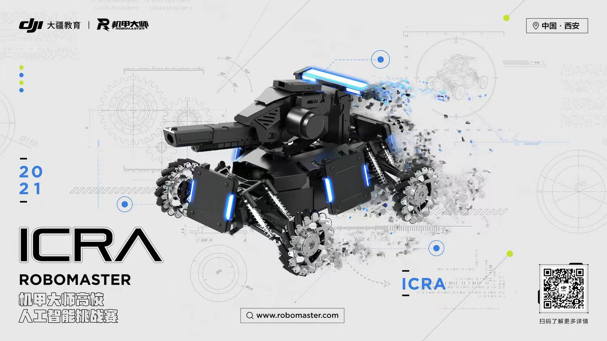

# ICRA 2021 RoboMaster AI Challenge
该项目是ICRA2021 RoboMaster AI Challenge **同舟共济的哥哥**战队的**感知、定位、导航、决策、规划**技术方案中的**感知**功能代码展示

Contact: [ru_yi_zhao@163.com](mailto:ru_yi_zhao@163.com). Any questions or discussions are welcomed! 

## 目录

- [比赛介绍](#比赛介绍)
- [感知功能介绍](#依赖环境及运行方式)
- [文件目录说明](#文件目录说明)
- [开源协议](#开源协议)
- [鸣谢](#鸣谢)

### 比赛介绍
ICRA RoboMaster 机甲大师高校人工智能挑战赛（[RMUA](https://www.robomaster.com/zh-CN/robo/icra?djifrom=nav), RoboMaster University AI Challenge）
自2017年起已连续五年由 DJI RoboMaster 组委会与全球机器人和自动化大会联合主办，并先后在新加坡、澳大利亚、加拿大和中国西安落地执行。该赛事吸引了全球大量顶尖学府、科研机构
参与竞赛和学术研讨，进一步扩大了 RoboMaster 在国际机器人学术领域的影响力。比赛需要参赛队综合运用机械、电控和算法等技术知识，自主研发全自动射击机器人参赛，对综合技术能力要求极高。

组委会提供统一标准的机器人平台，该机器人平台具备发射弹丸、攻击检测等统一标准的接口。参加比赛
的队伍需自行研发算法，配合搭载的传感器和运算设备来实现机器人的**自主决策、运动、射击**。参赛队伍需要准备一到两台机器人，
在 5.1m * 8.1m 的比赛场地上进行全自动射击对抗。比赛过程中，机器人通过识别并发射弹丸击
打对方的装甲模块，以减少对方的血量。比赛结束时，机器人总伤害量高的一方获得比赛胜利。

