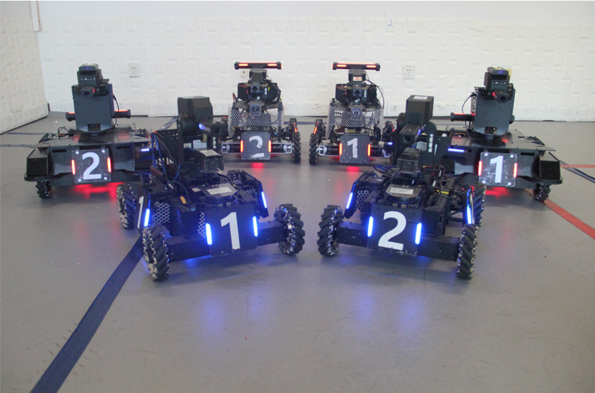
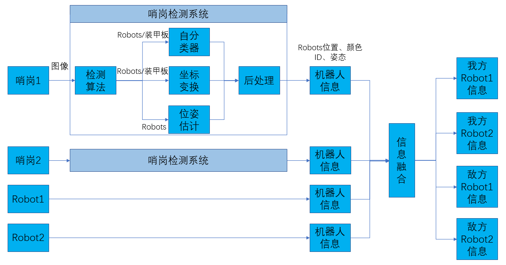
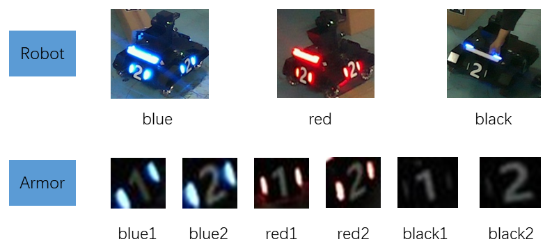
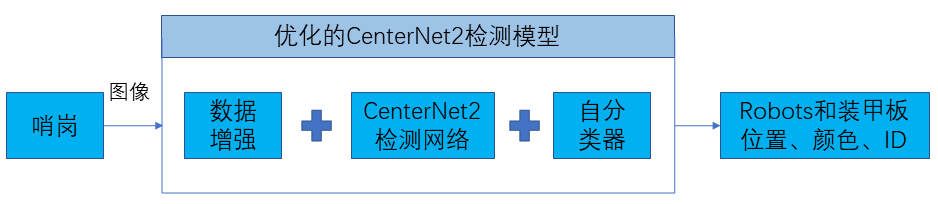
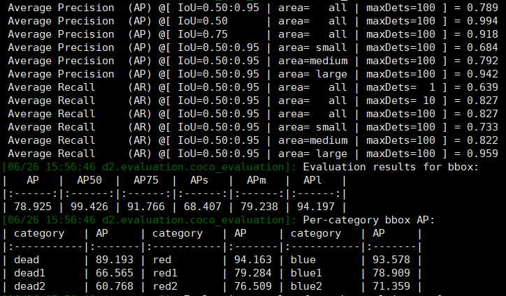
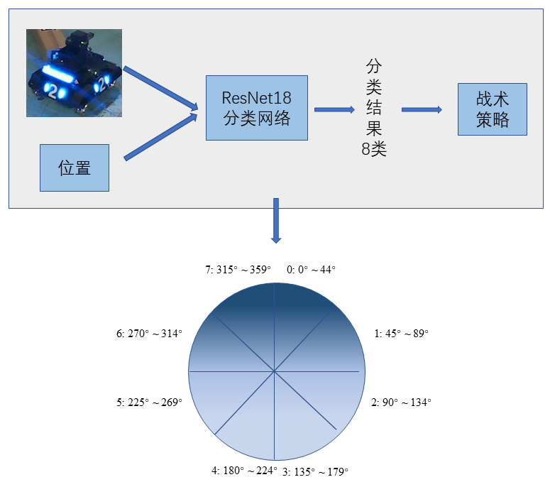

# ICRA 2021 RoboMaster AI Challenge
该项目是ICRA2021 RoboMaster AI Challenge **同舟共济的哥哥**战队的**感知、定位、导航、决策、规划**技术方案中的**感知**功能代码展示

Contact: [ru_yi_zhao@163.com](mailto:ru_yi_zhao@163.com). Any questions or discussions are welcomed! 

## 目录

- [比赛简介](#比赛简介)
- [感知系统](#感知系统)
- [哨岗算法](#哨岗算法)
- [开源协议](#开源协议)
- [鸣谢](#鸣谢)

## 比赛简介
ICRA RoboMaster 机甲大师高校人工智能挑战赛（[RMUA](https://www.robomaster.com/zh-CN/robo/icra?djifrom=nav), RoboMaster University AI Challenge）
自2017年起已连续五年由 DJI RoboMaster 组委会与全球机器人和自动化大会联合主办，并先后在新加坡、澳大利亚、加拿大和中国西安落地执行。该赛事吸引了全球大量顶尖学府、科研机构
参与竞赛和学术研讨，进一步扩大了 RoboMaster 在国际机器人学术领域的影响力。比赛需要参赛队综合运用机械、电控和算法等技术知识，自主研发全自动射击机器人参赛，对综合技术能力要求极高。

组委会提供统一标准的机器人平台，该机器人平台具备发射弹丸、攻击检测等统一标准的接口。参加比赛
的队伍需自行研发算法，配合搭载的传感器和运算设备来实现机器人的**自主决策、运动、射击**。参赛队伍需要准备一到两台机器人，
在 5.1m * 8.1m 的比赛场地上进行**全自动射击对抗**。比赛过程中，机器人通过识别并发射弹丸击
打对方的装甲模块，以减少对方的血量。比赛结束时，机器人总伤害量高的一方获得比赛胜利。

## 感知系统
感知模块功能是通过安装在机器人的**机载相机**和场地四周的**哨岗相机**，获取周围的信息。包括检测机器人和装甲板，识别机器人的阵营和编号，获取机器人的位置和姿态，输入给下游决策和规划模块。
+ **哨岗相机**
    + 配置: 两台工业相机, 分别放于对角处
    + 功能: 负责检测场地全局信息, 包括类别、位置、编号、位姿等
+ **机载相机**
    + 配置: 大恒工业相机和USB相机
    + 功能: 负责检测敌方装甲板, 直接决定射击方向(必须打到装甲板敌方才会掉血)

  
  <h3 align="center">RM AI机器人</h3> 

## 哨岗算法
### 1.设计思路
我方制定的哨岗感知算法的任务包括检测敌方机器人**位置、姿态**以及**编号**
+ **敌方机器人位置识别**: 要干掉敌方, 首先要知道对方在哪
+ **敌方机器人姿态识别**: 比赛规定, 击中敌方侧面和背面的伤害量分别是正面的两倍和三倍, 因此识别
出敌方姿态, 有利于执行**绕后**策略, 进行偷袭
+ **敌方机器人编号识别**: 从战术角度讲, 集中火力先秒掉一个或者收掉残血, 有利于胜利, 因此知道敌方
机器人编号, 有利于执行**围攻**和**收割**策略

### 2.哨岗系统架构
哨岗检测系统pipeline如下: 每个哨岗相机采集图像经过检测算法，输出装甲板和机器人检测框; 输出的装
甲板或者机器人经过自分类器得到机器人颜色和ID号，经过坐标变换得到机器人在世界坐标下的位置，经过位姿估计
模型得到机器人的位姿信息, 最后经过工程后处理, 进一步提升性能, 从而获得整个哨岗感知得到的机器人的位置、颜色、ID、位姿等
信息。两个哨岗和两个机器人的信息经过信息融合模块，最终输出4个机器人的信息。

### 3.检测模型
+ **设计思路**
    + 首先是**算法选型**: 理论上由于赛场上瞬息万变, 检测fps应越高越好(后期发现大多数队伍都是遵循这个原则, 有的甚至超过了1000fps), 
    但是经我们仔细研究场地发现, 哨岗其实主要用于当敌方消失在机载相机视野时以及执行特殊战术决策时(比如绕后), 因此并不需要
    太高fps, 反而更倾向于高精度, 因为错误的感知信息会严重影响决策系统。所以, 我们最终选择了当时的SOTA检测算法
    CenterNet2, fps大概5左右, 足够了。
    + 其次是**ID获取方案**: 最开始我们选用的是基于DeepSORT的**多目标跟踪**方案, 但后期发现世界赛场情况比较复杂, 受到障碍物遮挡等
    情况会丢失目标, 导致跟踪失败。因此最终我们采用直接检测的方法, 直接标注装甲板上的ID标签进行检测, 因此这就对检测算法性能提出更高
    的要求
    + 最后是**确定label**: 根据上述方案, 目标显然就是机器人和装甲板; 下面就是ID问题, 每方两辆, ID就是1和2, 最后就是颜色问题, 本来由于双方是红蓝对抗, 只有两种颜色, 但需要注意
    的是, 当某个机器人被干掉时, 颜色会熄灭, 这就诞生了第三种颜色, 因此颜色为red、blue、black。所有label如下所示:

+ **模型介绍**

    
    + **数据增强**
        + [Albumentations](https://github.com/albumentations-team/albumentations): 因机器人对颜色敏感, 去掉色彩类增强
        + [Imagecorruptions](https://github.com/bethgelab/imagecorruptions): 增加鲁棒性
        + [Mosiac](https://github.com/Tianxiaomo/pytorch-YOLOv4): 离线生成, 扩充数据集, 变相增加BS
        + [Mixup](https://github.com/facebookresearch/mixup-cifar10): 让模型更加鲁棒性的区分很相近的类别
    + **自分类器**: 本次比赛颜色是区分阵营的唯一办法, 因此分类性能尤为重要, 为进一步提升分类性能, 我们设计了一个自分类器。
    首先，通过裁剪ground-truth边界框得到图像patch, 并将每个patch的大小调整为64*64来构建训练集, 然后选择ResNet18作为分类器网络(实验验证约有1%
    的提点)。

+ **检测结果**

    + 受条件限制, 我们是在地下室搭建的场地, 因此拍出来的图像质量较差, 实际赛场上AP可达到90%以上
+ **运行效果图**

### 4.姿态估计
+ **算法流程**

  
  <h3 align="center">RM AI机器人</h3> 

    
+ **位姿结果**

| Class|Accuracy|
|:-:|:-:|
| 0 |83.2%|
| 1 |88.8%|
| 2 |84.7%|
| 3 |89.7%|
| 4 |80.3%|
| 5 |85.8%|
| 6 |89.5%|
| 7 |94.6%|
